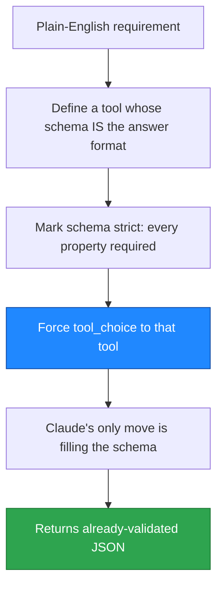

# Structured Test-Case Generation Agent

[](https://github.com/sadvi11/structured-test-agent/actions/workflows/tests.yml)


> An AI agent that turns a plain-English requirement into professional, structured test cases as strictly-validated JSON - using tool-forced schema output so the format is always valid.

## What It Does

Give it a requirement in plain English:

```bash
python agent.py "test a login form"
```

It returns a complete test suite as valid JSON - functional, negative, security, and boundary cases - each with ID, title, type, priority, preconditions, steps, test data, and expected result. From one line of input, it generated cases covering SQL injection, account lockout, email validation, and password masking.

## The Core Technique: Tool-Forced Structured Output

Most people ask an LLM for JSON and hope it comes back clean. This agent forces it:



Because the model is forced through a strict schema, there is nothing to parse and nothing that can come back malformed.

## How It Works


## Quick Start

```bash
git clone https://github.com/sadvi11/structured-test-agent.git
cd structured-test-agent
python3 -m venv .venv && source .venv/bin/activate
pip install -r requirements.txt
export ANTHROPIC_API_KEY="sk-ant-..."
python agent.py "test a checkout flow"
```

## Why This Pattern Matters

Reliable structured output separates an AI demo from something you can put in a pipeline. Forcing the model through a strict schema makes the output contract-guaranteed - exactly what production integrations need. The technique generalises: extracting data from documents, generating config, producing API payloads.

## Tech Stack

Python, Anthropic Claude API, tool-forced structured output.

## Author

Sadhvi Sharma - Cloud & AI Engineer. Ex-Nokia (cloud-native 5G core, 99.9% SLA) -> Cloud & AI.
Calgary, AB, Canada. [LinkedIn](https://linkedin.com/in/sadhvi-sharma) - [GitHub](https://github.com/sadvi11)
